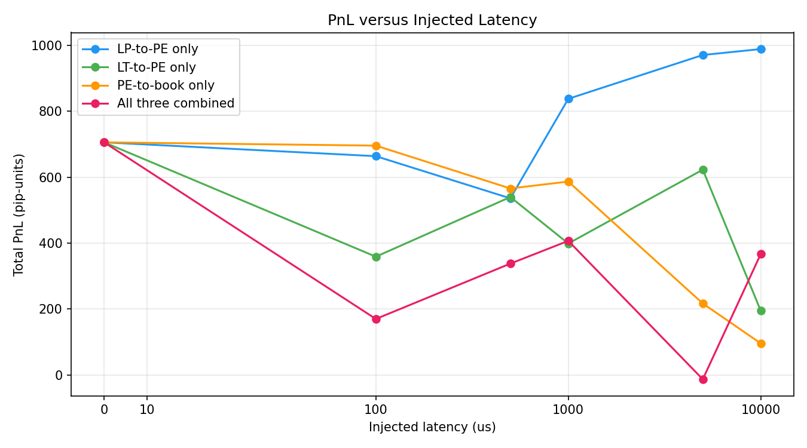
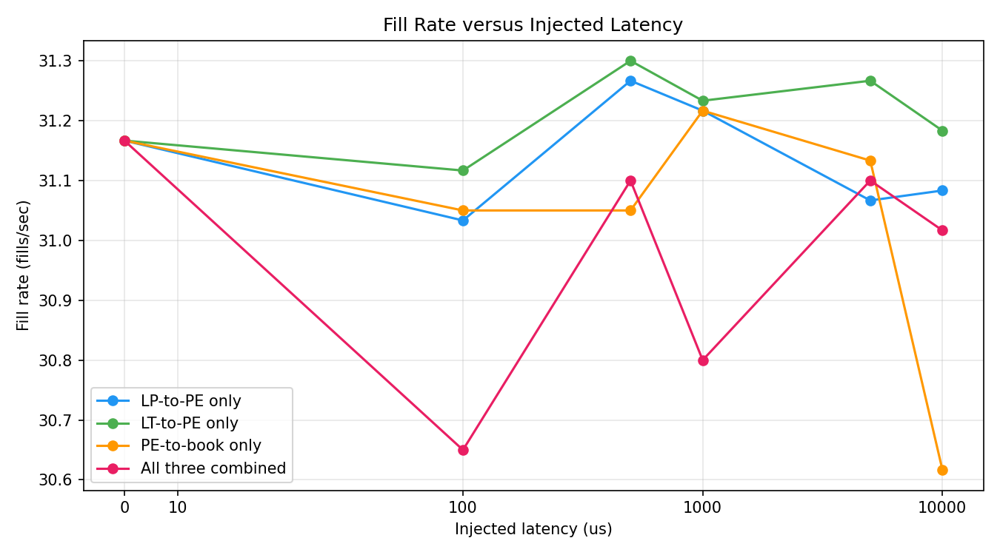
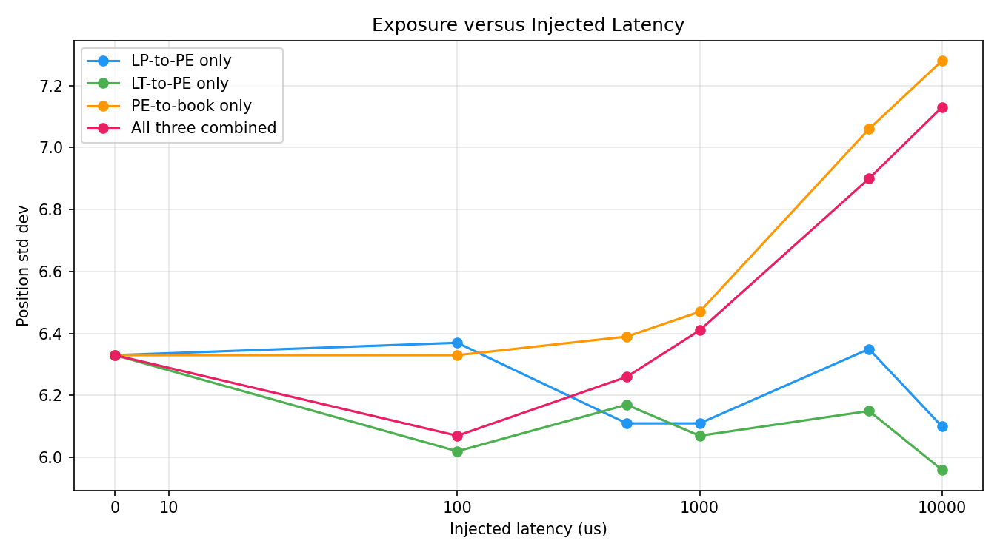

# Latency Study

## Question

What happens to strategy PnL, fill rate, and inventory exposure when wire latency is introduced between components? Which link hurts most, and does the result match the prior?

## Hypothesis

Before running the sweep:

1. **LP-to-PE latency** makes PE quote on a stale market view. Other participants hit PE when its price is wrong in their favour. PnL should fall.

2. **LT-to-PE latency** makes PE's view of its own fills lag. Hedge decisions fire on stale positions. Exposure variance should rise, PnL should fall.

3. **PE-to-book latency** makes quote updates land late. Stale quotes stay visible and get hit adversely. PnL should fall.

4. **Fill rate** direction is not obvious in advance.

5. **Exposure variance** should rise on every link, since delay anywhere makes either the hedge input or the hedge delivery stale.

## Methodology

21 runs across four sets: baseline (all latencies at 0), LP-to-PE only, LT-to-PE only, PE-to-book only, all three combined. Latency values: 0, 100, 500, 1000, 5000, 10000 us. Each run: 60 seconds, seed 42, default load (12 LP x 500 Hz, SG 100 Hz, LT 50 Hz). Only latency varies.

## Results

PE-to-book is the clearest line: PnL drops from ~700 pip-units at 0us to ~100 at 10ms. The combined run tracks it and goes negative around 5ms. LP-to-PE is the surprise: PnL rises monotonically, reaching ~990 at 10ms. LT-to-PE is noisy with no clear direction.

Fill rate sits between 30.6 and 31.3 fills/sec across all runs and all latency values. No link moves it meaningfully. The combined run is the noisiest but still does not shift the mean.

PE-to-book drives exposure up sharply: position std dev goes from 6.33 at 0us to 7.28 at 10ms. LP-to-PE stays flat throughout. LT-to-PE dips slightly below baseline at high latency, not above it.

## Discussion

**Prediction 1 (LP-to-PE degrades PnL): wrong.** PnL rose. The reason is that the LT in this simulation has no adverse selection logic. A real liquidity taker would compare PE's stale quote against current LP quotes and hit PE only when the mispricing is in its favour. Here, the LT fires market orders without inspecting staleness. So the mispricing never gets exploited. The PnL rise is likely a path artifact: delayed LP updates effectively smooth the feed, which changes how the spread-widening logic fires. This is a simulation gap, not a real-world result, and is noted in the limitations.

**Prediction 2 (LT-to-PE degrades PnL and raises exposure): wrong.**
LT-to-PE produced noisy PnL with no trend, and exposure slightly decreased at high latency. When fill notifications arrive late, PE's beta skew reacts to inventory changes after a delay, which means PE quotes closer to mid for longer before the skew kicks in. That counterintuitively reduces position variance compared to aggressive immediate skewing. This is a second-order effect of the specific parameter values, not a general result.

**Prediction 3 (PE-to-book degrades PnL): correct.** 
The most robust result in the study. Stale PE quotes stay visible after PE would have pulled or repriced them. The LT hits them. PnL falls from ~700 to ~100 pip-units across the tested range, monotonically. This is the stale-quote problem in market making and it shows up clearly.

**Prediction 4 (fill rate direction ambiguous): correct.** 
Fill rate is flat. The effects of stale quotes attracting extra fills and delayed hedge orders missing fills cancel out at these latency scales.

**Prediction 5 (exposure rises on every link): partially correct.** 
PE-to-book drives exposure up as predicted. LP-to-PE is flat. LT-to-PE goes the wrong direction. One of three links behaved as predicted.

The main result: PE-to-book latency is the most damaging link in this simulation. Quote update latency to the venue is the primary latency risk in any market-making system, and this study reproduces that.

## Limitations

- Single seed (42). Run-to-run variance is not quantified. Some of the noise in the LP-to-PE and LT-to-PE results may be single-path artifacts.
- Single machine. Numbers are not portable across CPUs.
- The LT has no adverse selection logic. This is the largest gap between this simulation and real market behaviour. It masks the expected LP-to-PE degradation entirely.
- LP prices follow a deterministic random walk with no correlation to signal. Spread capture at zero latency is path variance, not edge.
- LT arrivals are a simple Poisson process with no latency-dependent behaviour.
- Matching is simulated inside the PE consumer thread with a random tiebreak. Real venues use price-time priority or pro-rata.

## Future Work

The current model applies one constant latency per link, shared across all LPs. A more realistic model would assign heterogeneous per-LP latency profiles (LP1 at 50us, LP2 at 2ms) to study how PE behaves when some feeds are fresh and others are stale. This was scoped as a third-tier feature and not built for this submission.